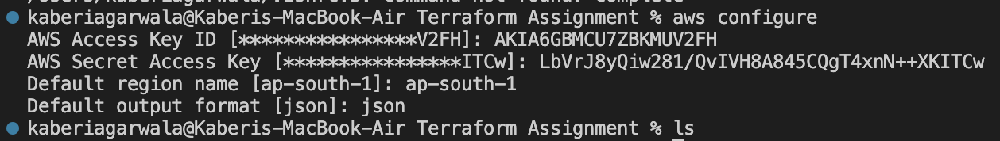
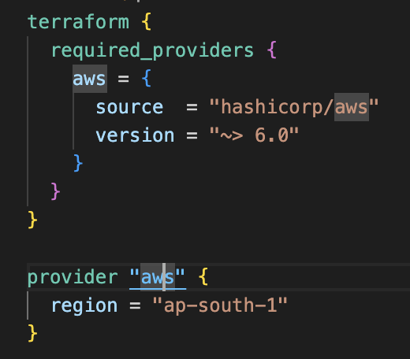
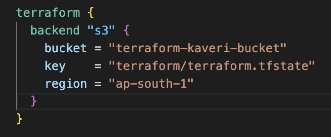

# Part 1: Infrastructure Setup with Terraform

## 1. AWS Setup and Terraform Initialization:

###   - Configure AWS CLI and authenticate with your AWS account.
        
###   - Initialize a new Terraform project targeting AWS.
        Created provider and backend blog
        
        
    
## 2. VPC and Network Configuration:

###   - Create an AWS VPC with two subnets: one public and one private.
        Created a folder for the vpc, as I am following a module based approach. 
        I have mentioned 3 blocks in main.tf file, one for vpc, one for private and one for public subnet.
        There is variable.tf file where all variables are defined.
###   - Set up an Internet Gateway and a NAT Gateway.

###   - Configure route tables for both subnets.